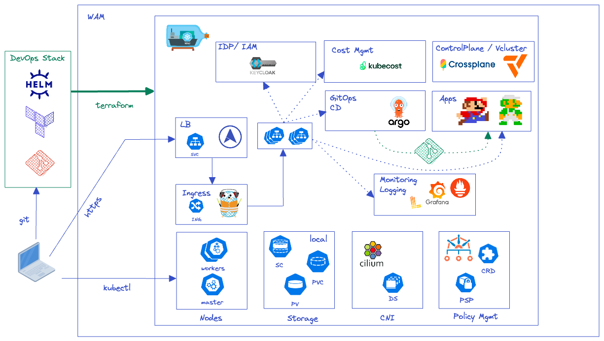

<!-- Improved compatibility of back to top link: See: https://github.com/othneildrew/Best-README-Template/pull/73 -->
<a name="readme-top"></a>
<!--
*** Thanks for checking out the Best-README-Template. If you have a suggestion
*** that would make this better, please fork the repo and create a pull request
*** or simply open an issue with the tag "enhancement".
*** Don't forget to give the project a star!
*** Thanks again! Now go create something AMAZING! :D
-->

<!-- PROJECT SHIELDS -->
<!--
*** I'm using markdown "reference style" links for readability.
*** Reference links are enclosed in brackets [ ] instead of parentheses ( ).
*** See the bottom of this document for the declaration of the reference variables
*** for contributors-url, forks-url, etc. This is an optional, concise syntax you may use.
*** https://www.markdownguide.org/basic-syntax/#reference-style-links
-->


<!-- TABLE OF CONTENTS -->
<details>
  <summary>Table of Contents</summary>
  <ol>
    <li>
      <a href="#about-the-project">About The Project</a>
      <ul>
        <li><a href="#built-with">Built With</a></li>
      </ul>
    </li>
    <li>
      <a href="#getting-started">Getting Started</a>
      <ul>
        <li><a href="#prerequisites">Prerequisites</a></li>
        <li><a href="#installation">Installation</a></li>
      </ul>
    </li>
    <li><a href="#architecture">Architecture</a></li>
    <li><a href="#usage">Usage</a></li>
    <li><a href="#roadmap">Roadmap</a></li>
    <li><a href="#contributing">Contributing</a></li>
    <li><a href="#license">License</a></li>
    <li><a href="#contact">Contact</a></li>
    <li><a href="#acknowledgments">Acknowledgments</a></li>
  </ol>
</details>


<!-- ABOUT THE PROJECT -->
## About The Project

Joli Kluster is a way to deploy a fully operational local production kubernetes cluster based on [Kind](https://github.com/kubernetes-sigs/kind).

Joli Kluster's goal is to deploy locally a production-ready kubernetes cluster. By ready for production I mean by the implementation of basic technical stack in order to manage:

* Monitoring - [Prometheus Stack](https://github.com/prometheus-community/helm-charts/)
* Logging - [Loki](https://github.com/grafana/helm-charts/tree/main/charts/loki-stack)
* Metrics - [Metric Server](https://github.com/kubernetes-sigs/metrics-server)
* GitOps - [ArgoCD](https://argo-cd.readthedocs.io/en/stable/)
* Ingress / Edge Router - [Traefik](https://github.com/traefik/traefik-helm-chart)
* BareMetal Load Balancer - [MetalLB](https://metallb.universe.tf/installation/)
* Secrets Management - [Bitnami Sealed Secret](https://github.com/bitnami-labs/sealed-secrets)
* Virtual Cluster - [Vcluster](https://www.vcluster.com/)
* Cloud Native Control Planes - [Crossplane](https://crossplane.io/)
* IAM Solution - [Keycloak](https://www.keycloak.org/)
* Policy Engine - [Kyverno](https://kyverno.io/policies/?policytypes=Best%2520Practices)
* Cost Management -  [Kubecost](https://www.kubecost.com/)
* SSL Management - [LetsEncrypt ACME Client Implementations for Traefik](https://letsencrypt.org/docs/client-options/)
* DNS Provider - [Gandi](https://www.gandi.net/fr)

Demo applications will also be deployed on the cluster. 
Thanks to [Alexwhen](https://github.com/alexwhen/docker-2048).

<p align="right">(<a href="#readme-top">back to top</a>)</p>

### Built With

This section should list any major frameworks/libraries used to bootstrap your project. Leave any add-ons/plugins for the acknowledgements section. Here are a few examples.

* 
* 
* 
* 
* 

<p align="right">(<a href="#readme-top">back to top</a>)</p>

<!-- GETTING STARTED -->
## Getting Started

This stack is for Developers, DevOps engineers, Kubernetes Developers and Administrators.
There is a lot of prerequisites packages you need to install locally before deploying the full stack.
Actually, the stack is **only** MacOS compatible. 

### Prerequisites

#### Packages

[Brew](https://brew.sh/) - A Package Manager for macOS
  ```sh
  /bin/bash -c "$(curl -fsSL https://raw.githubusercontent.com/Homebrew/install/HEAD/install.sh)"
  ```
[Docker](https://www.docker.com/) - An open platform for developing, shipping, and running containerized applications
  ```sh
  brew install docker
  ```   
[Docker Mac Net Connect](https://github.com/chipmk/docker-mac-net-connect) - To connect directly to Docker-for-Mac containers via IP address.
  ```sh
  # Install via Homebrew
  brew install chipmk/tap/docker-mac-net-connect
  # Run the service and register it to launch at boot
  sudo brew services start chipmk/tap/docker-mac-net-connect
  ```
[Terraform](https://www.terraform.io/) - An open-source, infrastructure as code software tool.
  ```sh
  brew tap hashicorp/tap
  brew install hashicorp/tap/terraform
  ```   
[Kubectl](https://www.terraform.io/) - The Kubernetes command-line tool to run commands against Kubernetes clusters.
  ```sh
  brew install kubectl
  ```   
[Helm](https://helm.sh/) - The Kubernetes package manager.
  ```sh
  brew install helm
  ```
[Gum](https://helm.sh/) - A tool for glamorous shell scripts.
  ```sh
  brew install gum
  ```
[Kubeseal](https://github.com/bitnami-labs/sealed-secrets) - The client-side utility for Bitnami Sealed Secrets.
  ```sh
  brew install kubeseal
  ```
[Kind](https://kind.sigs.k8s.io/) - A tool for running local Kubernetes clusters using Docker container “nodes".
  ```sh
  brew install kind
  ```
[Gandi](https://gandi.net) - A DNS Provider. The Traefik stack is based on this DNS Provider for SSL implementation and ACME Challenge.

#### Network & DNS

1. Create a temp kind cluster to retreive the docker network IPAM information
  ```sh
   # create temp cluster
   kind create cluster --name temp
   # retreive IPAM information for kind network
   docker network inspect --format "{{(index .IPAM.Config 0).Subnet}}" kind
   # note the CIDR Range for your kind cluster (example: 172.18.0.0/16) and delete the temp cluster
   kind delete cluster --name temp
  ```
2. From your kind network IP range, you must pick some IPs addresses for MetalLB. It will allow us to deploy Kubernetes Load Balancer Service type for all our applications reachable outside the cluster (example;: from my master range 172.18.0.0/16, I pick these IPs 172.18.0.150-172.18.0.200. So my first LB will pick the 172.18.0.150 IP address). 

3. Create a A record on your GANDI Provider for your futur Wildcard SAN Certificate. IP addresse should be the first one pick previously (example: 172.18.0.150). This IPs will be used by Ingress Controller Traefik.
 ```
   Example for mydomain.com
   Name  : *.sub
   Type  : A
   TTL   : 300
   Value : 172.18.0.150
 ```

### Installation & Clean

1. Clone the repo
   ```sh
   git clone git@github.com:beninanutshell/wam-tf-kind.git
   ```
2. Change your Load Balancer IPs addresses for MetalLB inside the [Helm's values.yaml line 29](https://github.com/beninanutshell/wam-tf-kind/blob/main/modules/metallb/values.yaml)
   ```sh
   configInline:
     address-pools:
       - name: default
         protocol: layer2
         addresses:
         - 172.18.0.150-172.18.0.200 # change it with your IPs. Here you can see that I reserved 50 IPS for my LB. That"s huge ;)
   ```
3. Go inside the bootstrap folder, make all the shell files executable, play that song and follow the guide.
   ```sh
   cd bootstrap/
   chmod +x *.sh
   ./0-init.sh
   ```
4. For cleaning your local Environnement, go inside the bootstrap folder and play that song.
   ```sh
   cd bootstrap/
   ./6-clean.sh
   ```

<p align="right">(<a href="#readme-top">back to top</a>)</p>

<!-- Architecutre -->
## Architecture

### High Level Design



<!-- USAGE EXAMPLES -->
## Usage

Use this space to show useful examples of how a project can be used. Additional screenshots, code examples and demos work well in this space. You may also link to more resources.

_For more examples, please refer to the [Documentation](https://example.com)_

<p align="right">(<a href="#readme-top">back to top</a>)</p>


<!-- ROADMAP -->
## Roadmap

- [x] Make a clean README.md file
- [x] Clean all orphan source files
- [ ] Add Cert Manager for Self Signed Issuer Certificates and remove GANDI lockin
- [ ] Multi-platforme implementation
- [ ] Add license.txt
- [ ] Improve shell scripts and terraform files
    - [ ] Comments
    - [ ] Outputs for Terraform


<p align="right">(<a href="#readme-top">back to top</a>)</p>


<!-- CONTRIBUTING -->
## Contributing

Contributions are what make the open source community such an amazing place to learn, inspire, and create. Any contributions you make are **greatly appreciated**.

If you have a suggestion that would make this better, please fork the repo and create a pull request. You can also simply open an issue with the tag "enhancement".
Don't forget to give the project a star! Thanks again!

1. Fork the Project
2. Create your Feature Branch (`git checkout -b feature/AmazingFeature`)
3. Commit your Changes (`git commit -m 'Add some AmazingFeature'`)
4. Push to the Branch (`git push origin feature/AmazingFeature`)
5. Open a Pull Request

<p align="right">(<a href="#readme-top">back to top</a>)</p>


<!-- LICENSE -->
## License

Distributed under the MIT License. See `LICENSE.txt` for more information.

<p align="right">(<a href="#readme-top">back to top</a>)</p>

<!-- ACKNOWLEDGMENTS -->
## Acknowledgments


* [Deploying keycloak on kubernetes cluster](https://medium.com/@shubhamdhote9717/keycloak-deployment-on-kubernetes-cluster-834bee73a567)
* [Securing Grafana with Keycloak SSO](https://medium.com/@charled.breteche/securing-grafana-with-keycloak-sso-d01fec05d984)
* [Kind, Keycloak and ArgoCD with SSO](https://medium.com/@charled.breteche/kind-keycloak-and-argocd-with-sso-9f3536dd7f61)
* [Google Kubernetes Engine, CircleCI and Traefik for a full-fledged GitOps platform in the cloud](https://blog.zenika.com/2021/01/15/google-kubernetes-engine-circleci-and-traefik-for-a-full-fledged-gitops-platform-in-the-cloud-part-1/)
* [Kyverno Installation](https://kyverno.io/docs/installation/)
* [Crossplane & Vcluster](https://github.com/salaboy/from-monolith-to-k8s/tree/main/platform/crossplane-vcluster)
* [Docker Connect directly to Docker-for-Mac containers via IP address](https://golangexample.com/connect-directly-to-docker-for-mac-containers-via-ip-address/)
* [Readme Best README template ](https://github.com/othneildrew/Best-README-Template)
* [Mario JS](https://github.com/tylerreichle/mario_js)

<p align="right">(<a href="#readme-top">back to top</a>)</p>


<!-- CONTACT -->
## Contact

Benjamin Coutellier - benjamin.coutellier@gmail.com

Project Link: [https://github.com/beninanutshell/wam-tf-kind](https://github.com/beninanutshell/wam-tf-kind)

<p align="right">(<a href="#readme-top">back to top</a>)</p>
